# A3 – Data Extraction From Research Papers

A pipeline that reads up to five research paper PDFs, pulls out their text, sends it to an AI provider for structured extraction, normalizes the fields, and writes a CSV. OpenAI is the default provider, but there's also a mock provider so you can review the pipeline without needing an API key, and a Gemini provider behind the same interface.

## Extracted fields

The output CSV has these columns:

| Column | Notes |
|--------|-------|
| `studyName` | |
| `country` | |
| `sampleSize` | |
| `intervention` | |
| `primaryOutcome` | |
| `resultDirection` | One of: `positive`, `negative`, `mixed`, `not reported` |

Any missing or malformed value defaults to `not reported` — no blank cells.

## Running it

Install and run tests:

```bash
npm install
npm test
```

Mock mode (no API key needed):

```bash
EXTRACTION_PROVIDER=mock npm start
```

Live extraction with OpenAI — put up to five PDFs in `input/papers` first:

```bash
OPENAI_API_KEY=your_key npm start
```

Output goes to `output/extracted-studies.csv`.

## File structure

```mermaid
graph TD
    A3["📁 A3/"]
    A3 --> input["📁 input/"]
    input --> papers["📁 papers/"]
    A3 --> output["📁 output/"]
    A3 --> src["📁 src/"]
    A3 --> test["📁 test/"]
    A3 --> envex[".env.example"]
    A3 --> pkg["package.json"]

    src --> cfg["📁 config/"]
    cfg --> cfgjs["config.js"]
    src --> err["📁 errors/"]
    err --> errjs["customErrors.js"]
    src --> pipe["📁 pipeline/"]
    pipe --> pipejs["pipeline.js"]
    src --> prom["📁 prompts/"]
    prom --> promjs["extractionPrompt.js"]
    src --> svc["📁 services/"]
    svc --> csv["csvService.js"]
    svc --> ep["extractionProvider.js"]
    svc --> gem["geminiService.js"]
    svc --> logsvc["loggerService.js"]
    svc --> mock["mockExtractionProvider.js"]
    svc --> oai["openAiService.js"]
    svc --> pdfsvc["pdfService.js"]
    svc --> valsvc["validationService.js"]
    src --> util["📁 utils/"]
    util --> jsonutil["json.js"]
    util --> retryutil["retry.js"]
    util --> sleeputil["sleep.js"]
    src --> idx["index.js"]

    test --> t1["csvService.test.js"]
    test --> t2["openAiService.test.js"]
    test --> t3["pipeline.test.js"]
    test --> t4["validationService.test.js"]
```



## How the pipeline works

1. `pipeline.js` scans `input/papers` for PDFs (caps at five, per the assessment).
2. `pdfService.js` extracts text from each file.
3. `extractionPrompt.js` builds a prompt targeting only the required fields.
4. The chosen provider (OpenAI by default) returns structured JSON.
5. `validationService.js` normalizes the response and fills in `not reported` for anything missing.
6. `csvService.js` writes the final CSV.

If a PDF fails, the pipeline logs the error, writes a placeholder row, and moves on.

## Environment variables

```bash
EXTRACTION_PROVIDER=openai        # or "mock" or "gemini"
OPENAI_API_KEY=your_key
OPENAI_MODEL=gpt-4.1-mini
OPENAI_TIMEOUT_MS=30000
OPENAI_MAX_ATTEMPTS=3
INPUT_DIRECTORY=input/papers
OUTPUT_CSV_PATH=output/extracted-studies.csv
```

For Gemini:

```bash
EXTRACTION_PROVIDER=gemini GEMINI_API_KEY=your_key GEMINI_MODEL=gemini-2.5-flash npm start
```

## What I'd improve

A small set of real PDF fixtures with expected CSV outputs for regression testing. I'd also save the prompt, model name, and provider metadata alongside the CSV so each run has a proper audit trail.
