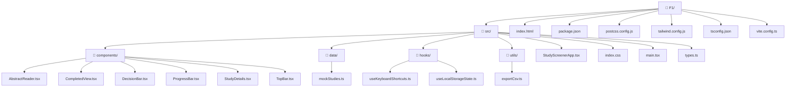

# F1 – Study Screener Interface

A React + Vite study screening tool for reviewing 50 research studies. The reviewer moves through the queue, reads each study's metadata and abstract, and marks it as `include`, `exclude`, or `flag`. All decisions persist in `localStorage` so nothing is lost on refresh.

## Running it

```bash
npm install
npm run dev
```

Production build:

```bash
npm run build
```

## Features

- 50-study mock dataset with realistic study templates
- Include, exclude, and flag decisions per study
- Keyboard shortcuts: `I` include, `E` exclude, `F` flag, arrow keys to navigate
- Progress tracking across the full queue
- Resumes at the next unreviewed study after a refresh
- Completion summary once every study has a decision
- Light/dark theme toggle (persisted locally)
- Responsive layout for desktop and smaller screens

## Input and output

The input is the mock study list in `src/data/mockStudies.ts`. Each study has:

```ts
{
  id: string;
  title: string;
  authors: string;
  shortAuthors: string;
  year: number;
  source: string;
  journal: string;
  tags: string[];
  status: string;
  abstract: { label: string; text: string }[];
}
```

The main output is the saved decision map in browser `localStorage` under
`sabi-f1-decisions`:

```json
{
  "study-42": "include",
  "study-43": "exclude",
  "study-44": "flag"
}
```

When all studies are reviewed, the `Export Decisions` button downloads
`sabi-screening-decisions.csv` with this shape:

```csv
"Study ID","Title","Authors","Year","Source","Decision"
"study-42","Efficacy of AI-driven diagnostics in systematic reviews","Chen, Y., Patel, K., & Smith, J.","2020","PubMed","include"
```

## File structure



## Design decisions

Most of the workflow state lives in `StudyScreenerApp.tsx` — current study index, saved decisions, and theme. The child components are mainly presentational, which keeps the button clicks and keyboard shortcuts going through the same handler. That way there's no divergence between mouse and keyboard behavior.

I went with `localStorage` because the prompt asks for persistence across refreshes without needing a backend. If this were hooked up to a real screening workflow, `mockStudies.ts` is the obvious swap point for an API call.

## What I'd improve

Reviewer notes per study, conflict-resolution states for multi-reviewer setups, and swapping the mock data for a real API-backed queue. I'd also add component tests around the keyboard shortcuts and the completion view.
