# Sabi Core 

My submission for the Sabi Core Software Engineer (AI & Research Platforms) take-home.

I picked one question from each track:

- **F1** – Study screener interface (frontend)
- **B2** – OpenAlex integration with rate limiting (backend)
- **A3** – Data extraction from research papers (AI)

Each answer lives in its own folder and can be run independently. Everything uses Node 18+ and npm as requested. Mock data is used where the assessment didn't provide input — details are in each folder's README.

## Repo layout

```mermaid
graph TD
    root["📁 ."]
    root --> F1["📁 F1/ – Study screener"]
    root --> B2["📁 B2/ – OpenAlex client"]
    root --> A3["📁 A3/ – PDF extraction"]
    root --> gitignore[".gitignore"]
    root --> rootreadme["README.md"]

    F1 --> f1src["📁 src/"]
    f1src --> f1comp["📁 components/"]
    f1src --> f1data["📁 data/"]
    f1src --> f1hooks["📁 hooks/"]
    f1src --> f1utils["📁 utils/"]
    f1src --> f1app["StudyScreenerApp.tsx"]
    f1src --> f1css["index.css"]
    f1src --> f1main["main.tsx"]
    f1src --> f1types["types.ts"]
    F1 --> f1html["index.html"]
    F1 --> f1pkg["package.json"]
    F1 --> f1post["postcss.config.js"]
    F1 --> f1tw["tailwind.config.js"]
    F1 --> f1ts["tsconfig.json"]
    F1 --> f1vite["vite.config.ts"]

    B2 --> b2src["📁 src/"]
    b2src --> b2idx["index.js"]
    b2src --> b2oac["openAlexClient.js"]
    b2src --> b2norm["normalizeOpenAlexWork.js"]
    b2src --> b2rl["rateLimiter.js"]
    b2src --> b2ret["retry.js"]
    b2src --> b2log["logger.js"]
    B2 --> b2test["📁 test/"]
    b2test --> b2tf["openAlexClient.test.js"]
    B2 --> b2env[".env.example"]
    B2 --> b2pkg["package.json"]

    A3 --> a3input["📁 input/papers/"]
    A3 --> a3output["📁 output/"]
    A3 --> a3src["📁 src/"]
    a3src --> a3cfg["📁 config/"]
    a3src --> a3err["📁 errors/"]
    a3src --> a3pipe["📁 pipeline/"]
    a3src --> a3prom["📁 prompts/"]
    a3src --> a3svc["📁 services/"]
    a3src --> a3util["📁 utils/"]
    a3src --> a3idx["index.js"]
    A3 --> a3test["📁 test/"]
    A3 --> a3env[".env.example"]
    A3 --> a3pkg["package.json"]
```



## Requirements

- Node.js 18+
- npm
- `OPENAI_API_KEY` (only needed for live A3 extraction)

No database needed for any of these.

## Quick start

Run each project from its own folder.

### F1 – Frontend screener

```bash
cd F1
npm install
npm run dev
```

Open the Vite URL printed in the terminal.

### B2 – OpenAlex client

```bash
cd B2
npm install
npm test
node src/index.js "malaria vaccine"
```

### A3 – PDF extraction pipeline

```bash
cd A3
npm install
npm test
```

Run without an API key (mock mode):

```bash
EXTRACTION_PROVIDER=mock npm start
```

Run against OpenAI — put up to five PDFs in `A3/input/papers` first:

```bash
OPENAI_API_KEY=your_key npm start
```

Output goes to `A3/output/extracted-studies.csv`.

## Scope notes

I kept things focused on what the prompts actually asked for rather than adding extras. The frontend uses a mock set of 50 studies since no dataset was provided. B2 hits the real OpenAlex API. A3 can run in mock mode for review without a key, and defaults to OpenAI for the live provider.

Each folder has its own README with more on design decisions and what I'd do with more time.
